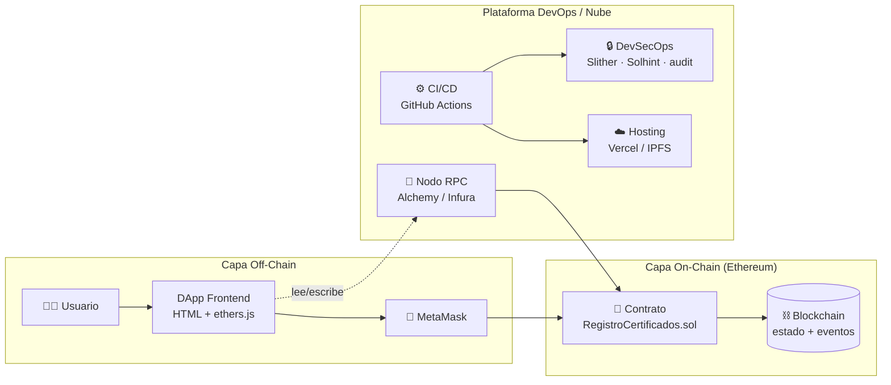
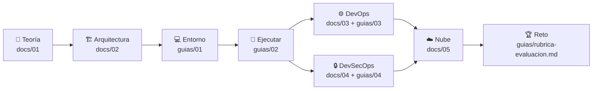

# 🎓 Repositorio Didáctico — Unidad 1: Blockchain DevOps

> **Curso:** Blockchain · **UTPL** · Ciclo Abril–Agosto 2026
> **Unidad 1:** Blockchain DevOps — *1.1 Fundamentos DevOps* · *1.2 Fundamentos DevSecOps*
> **Caso de estudio:** una DApp de **Registro de Certificados Académicos** sobre Ethereum.

Este repositorio es un **laboratorio completo y funcional** para aprender DevOps y DevSecOps
aplicados a blockchain. No es solo teoría: incluye un contrato inteligente real, pruebas
automatizadas, una DApp web, pipelines de CI/CD y de seguridad, y documentación que enfatiza el
**modelado**, la **arquitectura** y la **arquitectura en la nube** de la solución.

---

## 📐 Arquitectura en una imagen



Diagramas detallados (C4, modelo de datos, secuencia, despliegue) en
[`docs/02-arquitectura/`](docs/02-arquitectura/).

---

## 🗂️ Estructura del repositorio

```
repoSemanaUno/
├── contracts/RegistroCertificados.sol   Contrato inteligente (Solidity 0.8.24)
├── test/RegistroCertificados.test.js    12 pruebas automatizadas (Mocha + Chai)
├── scripts/deploy.js                    Despliegue → genera frontend/deployment.json
├── frontend/                            DApp (HTML + ethers.js v6 + MetaMask)
├── .github/workflows/
│   ├── ci.yml                           Pipeline de Integración Continua
│   └── devsecops.yml                    Pipeline de seguridad automatizada
├── docs/
│   ├── 01-investigacion/                📖 Teoría: DevOps, DevSecOps, glosario, referencias
│   ├── 02-arquitectura/                 🏗️ Modelado: C4, datos, secuencia, despliegue
│   ├── 03-devops/                       ⚙️ Práctica DevOps: CI/CD detallado
│   ├── 04-devsecops/                    🔒 Práctica de seguridad
│   └── 05-nube/                         ☁️ Arquitectura en la nube e IaC
├── guias/                               🎓 Guías paso a paso para el estudiante
└── README.md                            Este archivo
```

---

## 🧰 Requisitos de instalación

Esto es lo que necesitas tener instalado en tu máquina **antes** de ejecutar el repo. La guía
detallada paso a paso para Windows, macOS y Linux está en
[`guias/01-preparacion-del-entorno.md`](guias/01-preparacion-del-entorno.md).

### Imprescindibles

| Herramienta | Versión | Para qué | Cómo obtenerlo |
|-------------|---------|----------|----------------|
| **Node.js + npm** | LTS **20 o 22** | Ejecutar Hardhat, las pruebas y los scripts | [nodejs.org](https://nodejs.org) (o `nvm`) |
| **Git** | reciente | Clonar el repositorio | [git-scm.com](https://git-scm.com) |
| **Navegador + MetaMask** | última | Usar la DApp y firmar transacciones | [metamask.io](https://metamask.io) |

> 💡 **No necesitas instalar Solidity, Hardhat, ethers, Solhint ni Prettier a mano.** Todo eso son
> dependencias del proyecto y se instalan solas con `npm install`. El compilador de Solidity
> (`solc 0.8.24`) lo descarga Hardhat automáticamente la primera vez que compilas.

### Para servir el frontend (cualquiera de las dos)

Ya tienes una de estas si instalaste Node o si usas macOS/Linux:

- **Node:** `npx serve frontend`
- **Python 3:** `python3 -m http.server 8000 --directory frontend`

### Opcionales (laboratorio DevSecOps y alternativas)

| Herramienta | Para qué | Cómo obtenerlo |
|-------------|----------|----------------|
| **Python 3.8+ y Slither** | Análisis estático de seguridad del contrato (`npm run security:slither`) | `pip install slither-analyzer` |
| **Foundry / Anvil** | Nodo local alternativo a `npm run node` | `curl -L https://foundry.paradigm.xyz \| bash` y luego `foundryup` |

### Verifica tu instalación

```bash
node -v          # debe mostrar v20.x o v22.x
npm -v
git --version
```

Si los tres comandos responden con una versión, ya puedes pasar al **Inicio rápido**.

---

## 🚀 Inicio rápido

> **Requisito recomendado:** Node.js **LTS 20 o 22**. (Funciona con versiones más nuevas, pero
> Hardhat muestra una advertencia.) Guía de instalación detallada en
> [`guias/01-preparacion-del-entorno.md`](guias/01-preparacion-del-entorno.md).

```bash
# 1. Instalar dependencias
npm install

# 2. Ejecutar las pruebas (deben pasar las 12)
npm test

# 3. Compilar el contrato
npm run compile
```

Para correr la **DApp completa** en local:

```bash
# Terminal 1 — nodo blockchain local (déjalo abierto)
npm run node

# Terminal 2 — desplegar el contrato en el nodo local
npm run deploy:local

# Terminal 2 — servir el frontend
npx serve frontend     # o: python3 -m http.server 8000 --directory frontend
```

Abre el navegador, conecta MetaMask a la red local (`http://127.0.0.1:8545`, *chainId* `31337`),
importa una cuenta de prueba que imprime `npm run node`, y emite/verifica un certificado.
Tutorial completo en [`guias/02-ejecutar-el-proyecto.md`](guias/02-ejecutar-el-proyecto.md).

---

## 📜 Scripts disponibles

| Comando | Qué hace |
|---------|----------|
| `npm test` | Ejecuta las 12 pruebas automatizadas |
| `npm run compile` | Compila el contrato con solc 0.8.24 |
| `npm run coverage` | Reporte de cobertura de pruebas |
| `npm run lint:sol` | Linter de Solidity (Solhint) |
| `npm run format` | Formatea código (Prettier) |
| `npm run node` | Levanta un nodo Ethereum local |
| `npm run deploy:local` | Despliega el contrato en el nodo local |
| `npm run security:slither` | Análisis estático de seguridad (requiere Slither) |

---

## 🧭 Ruta de aprendizaje



| Paso | Material | Dónde |
|------|----------|-------|
| 1 | Fundamentos DevOps y DevSecOps | [`docs/01-investigacion/`](docs/01-investigacion/) |
| 2 | Modelado y arquitectura | [`docs/02-arquitectura/`](docs/02-arquitectura/) |
| 3 | Preparar el entorno | [`guias/01-preparacion-del-entorno.md`](guias/01-preparacion-del-entorno.md) |
| 4 | Ejecutar el proyecto | [`guias/02-ejecutar-el-proyecto.md`](guias/02-ejecutar-el-proyecto.md) |
| 5 | Laboratorio DevOps (CI/CD) | [`docs/03-devops/`](docs/03-devops/) · [`guias/03-laboratorio-devops.md`](guias/03-laboratorio-devops.md) |
| 6 | Laboratorio DevSecOps | [`docs/04-devsecops/`](docs/04-devsecops/) · [`guias/04-laboratorio-devsecops.md`](guias/04-laboratorio-devsecops.md) |
| 7 | Arquitectura en la nube | [`docs/05-nube/`](docs/05-nube/) |
| 8 | Reto y evaluación | [`guias/rubrica-evaluacion.md`](guias/rubrica-evaluacion.md) |

¿Eres nuevo? Empieza por [`guias/README.md`](guias/README.md). ¿Tienes dudas?
[`guias/preguntas-frecuentes.md`](guias/preguntas-frecuentes.md).

---

## 🔐 El contrato `RegistroCertificados` en breve

Una institución (el **propietario**) autoriza a **emisores** que pueden registrar certificados
académicos. Cualquiera puede **verificar** un certificado de forma pública y gratuita. Los
certificados no se borran: se **revocan** (inmutabilidad y auditabilidad).

| Función | Quién | Tipo |
|---------|-------|------|
| `emitirCertificado(nombre, curso)` | Emisor autorizado | Escritura (gas) |
| `revocarCertificado(hash)` | Emisor autorizado | Escritura (gas) |
| `verificarCertificado(hash)` | Cualquiera | Lectura (gratis) |
| `autorizarEmisor / revocarEmisor` | Propietario | Escritura (gas) |

El diseño aplica patrones de seguridad (control de acceso por roles, errores personalizados,
eventos de auditoría) que se analizan en
[`docs/04-devsecops/`](docs/04-devsecops/).

---

## 🤖 Cómo se construyó este repositorio

Este material se elaboró con un **equipo de agentes inteligentes especializados**, cada uno
responsable de un área (investigación, arquitectura/diseño, DevOps, DevSecOps, nube y guías),
coordinados por un agente orquestador que construyó y validó el núcleo técnico.

---

## 📄 Licencia

MIT — material educativo de libre uso para fines didácticos.
