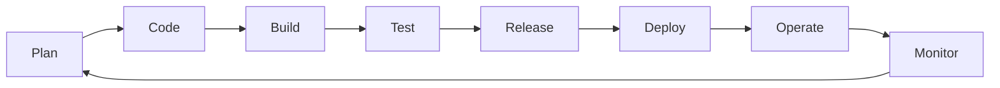

# Fundamentos de DevOps

## ¿Qué es DevOps?

**DevOps** es una cultura y un conjunto de prácticas que unen el desarrollo de software
(*Dev*) y las operaciones de TI (*Ops*) para entregar valor de forma **rápida**,
**frecuente** y **fiable**. No es una herramienta ni un cargo: es una forma de trabajar que
se apoya en la automatización.

Antes de DevOps, los desarrolladores "lanzaban el código por encima del muro" a operaciones.
Resultado: despliegues lentos, manuales y propensos a error. DevOps derriba ese muro.

## El modelo CALMS

| Letra | Pilar | En este proyecto |
|-------|-------|------------------|
| **C** | Culture (cultura de colaboración) | Todo el equipo es responsable de la calidad |
| **A** | Automation (automatización) | CI/CD, Terraform, pruebas automáticas |
| **L** | Lean (flujo eficiente, poco desperdicio) | Feedback rápido al hacer push |
| **M** | Measurement (medir todo) | Cobertura de pruebas, estado del pipeline |
| **S** | Sharing (compartir conocimiento) | Documentación y guías como esta |

## El ciclo de vida (el "infinito" de DevOps)

Es un ciclo continuo: nunca "se termina", se mejora constantemente.

## CI/CD: el corazón técnico

- **Integración Continua (CI):** integrar el código frecuentemente; cada cambio se compila
  y prueba automáticamente. → `.github/workflows/ci.yml`
- **Entrega Continua (Continuous Delivery):** el código siempre está listo para
  desplegarse con un clic.
- **Despliegue Continuo (Continuous Deployment):** cada cambio que pasa las pruebas se
  despliega solo. → AWS Amplify + CodePipeline.

## Infraestructura como Código (IaC)

Definir servidores, redes y servicios en **archivos de texto versionados** en vez de
configurarlos a mano. Ventajas: reproducibilidad, revisión por pares, historial de cambios.
En este proyecto usamos **Terraform** (ver [`docs/05-nube/`](../05-nube/)).

## DevOps aplicado a blockchain

Los contratos inteligentes son **inmutables** una vez desplegados: un error no se "parchea"
en caliente. Por eso DevOps es aún **más crítico** en blockchain:

- Las pruebas automáticas son la última defensa antes de un despliegue irreversible.
- El despliegue del contrato debe ser reproducible y auditable.
- El frontend (off-chain) sí se actualiza con CI/CD tradicional.

→ Continúa con [DevSecOps](devsecops.md).
