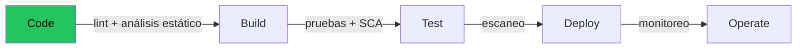

# Fundamentos de DevSecOps

## ¿Qué es DevSecOps?

**DevSecOps** integra la **seguridad** (*Sec*) en todo el ciclo DevOps, de forma automática
y desde el principio. La seguridad deja de ser una auditoría final que frena el lanzamiento
y se convierte en una responsabilidad **compartida y continua**.

## Shift-left security

"Mover la seguridad a la izquierda" significa detectar problemas **lo antes posible** en el
ciclo de vida, cuando corregirlos es barato:

Cuanto más a la izquierda (más cerca del `code`) detectas un fallo, más barato es. Un bug de
seguridad en producción cuesta órdenes de magnitud más que uno detectado en el commit.

## Los tres controles de este proyecto

| Control | Tipo | Herramienta | Pipeline |
|---------|------|-------------|----------|
| Análisis estático del contrato | SAST | **Slither** | `devsecops.yml` |
| Auditoría de dependencias | SCA | **npm audit** | `devsecops.yml` |
| Lint de seguridad | SAST ligero | **Solhint** | `ci.yml` + `devsecops.yml` |

- **SAST** (Static Application Security Testing): analiza el código sin ejecutarlo.
- **SCA** (Software Composition Analysis): busca CVEs en las librerías que usas.

## Riesgos típicos en contratos inteligentes

| Vulnerabilidad | Qué es | Defensa en este proyecto |
|----------------|--------|--------------------------|
| **Reentrancy** | Una llamada externa reentra antes de actualizar el estado | No hacemos llamadas externas de valor |
| **Control de acceso roto** | Funciones críticas sin restricción | Modificadores `soloPropietario` / `soloEmisor` |
| **Integer overflow** | Desbordamiento aritmético | Solidity 0.8+ revierte por defecto |
| **Datos sin validar** | Entradas vacías o inválidas | `revert DatosVacios()` / `DireccionInvalida()` |
| **Falta de auditoría** | No se puede rastrear qué pasó | Eventos en cada cambio de estado |

## Gestión de secretos

Regla de oro: **ningún secreto en el repositorio**.

- Claves privadas y API keys → variables de entorno (`.env`, en `.gitignore`).
- En la nube → **AWS SSM Parameter Store** cifrado (no en el código del pipeline).
- Terraform → `terraform.tfvars` en `.gitignore`; el `tfstate` con backend cifrado.

## Principio de mínimo privilegio

Cada componente recibe **solo** los permisos que necesita. En AWS, los roles IAM de
CodeBuild y CodePipeline están acotados a sus acciones y recursos específicos (ver
`infra/terraform/codepipeline.tf`).

→ Ver el [glosario](glosario.md) para los términos.
