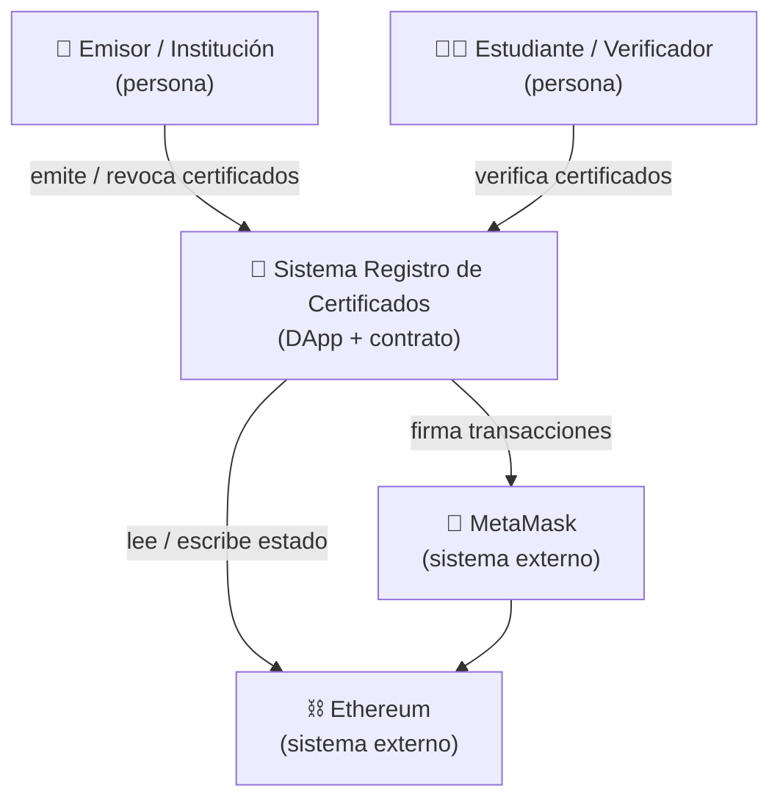
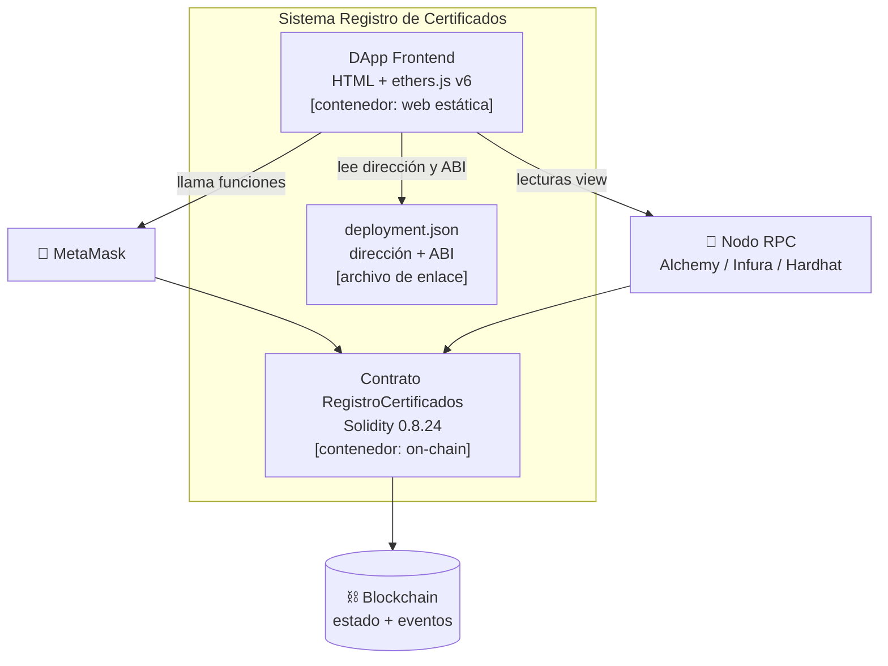

# Modelo C4

El modelo **C4** describe una arquitectura en niveles de zoom: Contexto → Contenedores →
Componentes. Aquí mostramos los dos primeros, suficientes para este proyecto.

## Nivel 1 — Contexto

¿Quién usa el sistema y con qué se relaciona?

## Nivel 2 — Contenedores

¿Qué piezas desplegables componen el sistema?

## Mapeo a carpetas del repo

| Contenedor | Dónde vive |
|------------|-----------|
| DApp Frontend | `frontend/` |
| Contrato | `contracts/RegistroCertificados.sol` |
| deployment.json | `frontend/deployment.json` (lo genera `scripts/deploy.js`) |
| Pruebas | `test/RegistroCertificados.test.js` |
| Infra nube | `infra/terraform/` |
