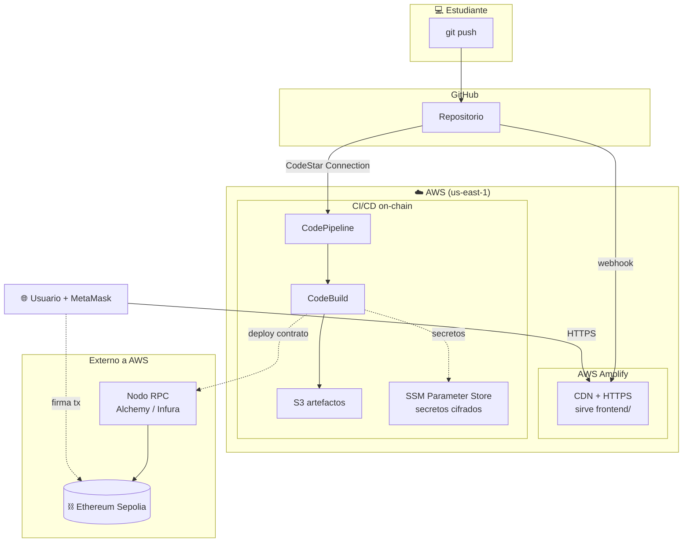

# Diagrama de despliegue

¿Dónde corre físicamente cada pieza en producción (AWS)?

## Nodos de despliegue

| Nodo | Tecnología | Qué aloja |
|------|-----------|-----------|
| Amplify | CDN gestionado | Frontend estático con HTTPS |
| CodePipeline + CodeBuild | Contenedores efímeros | Compila, prueba y despliega el contrato |
| S3 | Almacenamiento de objetos | Artefactos del pipeline |
| SSM Parameter Store | Almacén cifrado | RPC URL, clave privada |
| Nodo RPC (externo) | Alchemy/Infura | Puerta de entrada a Ethereum |
| Ethereum Sepolia (externo) | Red descentralizada | El contrato y su estado |

## Decisiones de despliegue

- **Frontend y contrato se despliegan por caminos separados** porque tienen ciclos de vida
  distintos: el frontend cambia a menudo; el contrato es inmutable y se redepliega solo
  cuando cambia su código.
- **Los secretos viven en SSM, no en el repo ni en el pipeline** (DevSecOps).
- **Toda la infra de AWS se crea con Terraform** (`infra/terraform/`), no a mano.

Detalle operativo y costos en [`docs/05-nube/`](../05-nube/) y la práctica en
[`guias/05-despliegue-aws.md`](../../guias/05-despliegue-aws.md).
