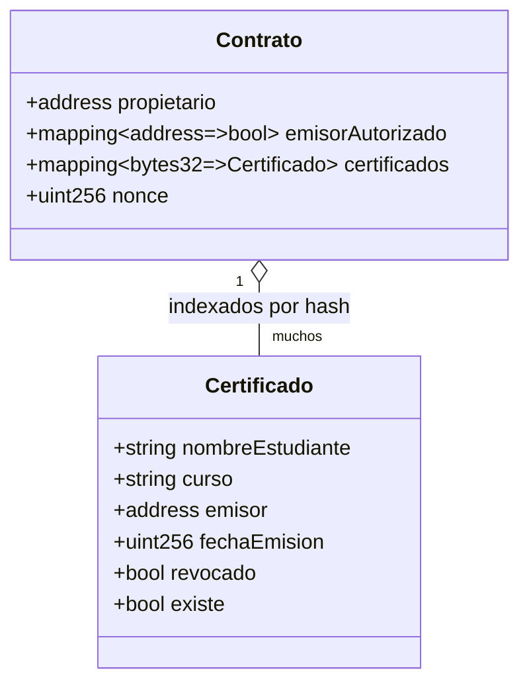

# Modelo de datos

El estado vive **on-chain**, en el contrato `RegistroCertificados`. No hay base de datos
tradicional: la blockchain *es* la base de datos (inmutable y auditable).

## Entidades



## Estructura `Certificado`

| Campo | Tipo | Significado |
|-------|------|-------------|
| `nombreEstudiante` | `string` | Nombre del titular |
| `curso` | `string` | Curso o programa certificado |
| `emisor` | `address` | Quién lo emitió |
| `fechaEmision` | `uint256` | Timestamp del bloque de emisión |
| `revocado` | `bool` | `true` si fue revocado (no se borra) |
| `existe` | `bool` | Distingue "no emitido" de "emitido con datos vacíos" |

## La clave: el hash del certificado

Cada certificado se indexa con un `bytes32` único:

```solidity
keccak256(abi.encodePacked(nombreEstudiante, curso, msg.sender, block.timestamp, nonce))
```

El `nonce` (contador interno) garantiza unicidad **aunque** dos certificados tengan los
mismos datos en el mismo bloque.

## Mapeos de control de acceso

- `propietario` (`immutable`): la institución; se fija en el constructor y no cambia.
- `emisorAutorizado`: qué direcciones pueden emitir/revocar.

## Por qué "revocar" y no "borrar"

Borrar destruiría el rastro histórico. Revocar marca `revocado = true` pero conserva el
registro y emite un evento `CertificadoRevocado`. Así, cualquiera puede auditar que un
certificado **existió** y **fue revocado**, con su fecha y emisor. Eso es inmutabilidad y
trazabilidad: el valor real de poner esto en blockchain.
