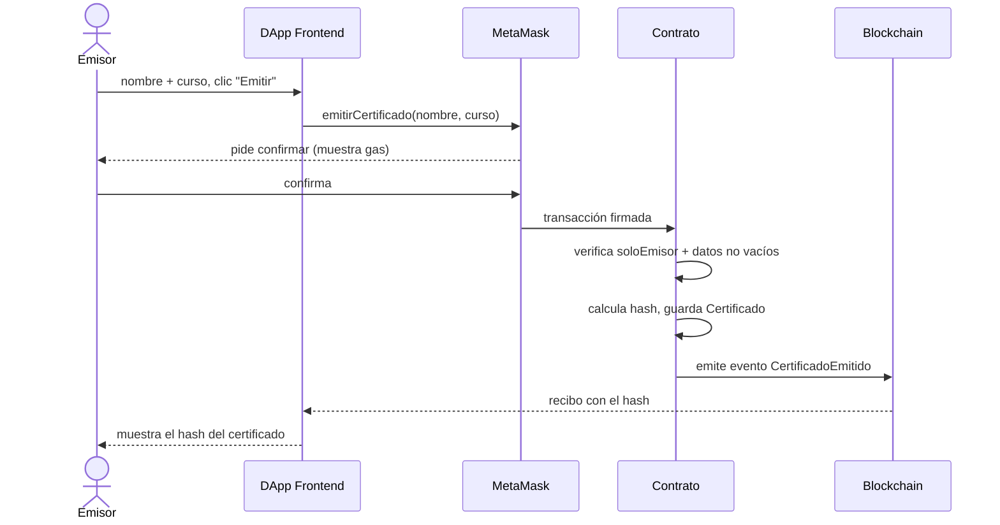
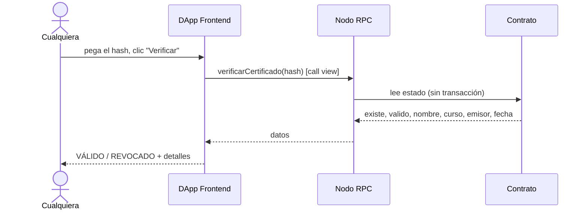
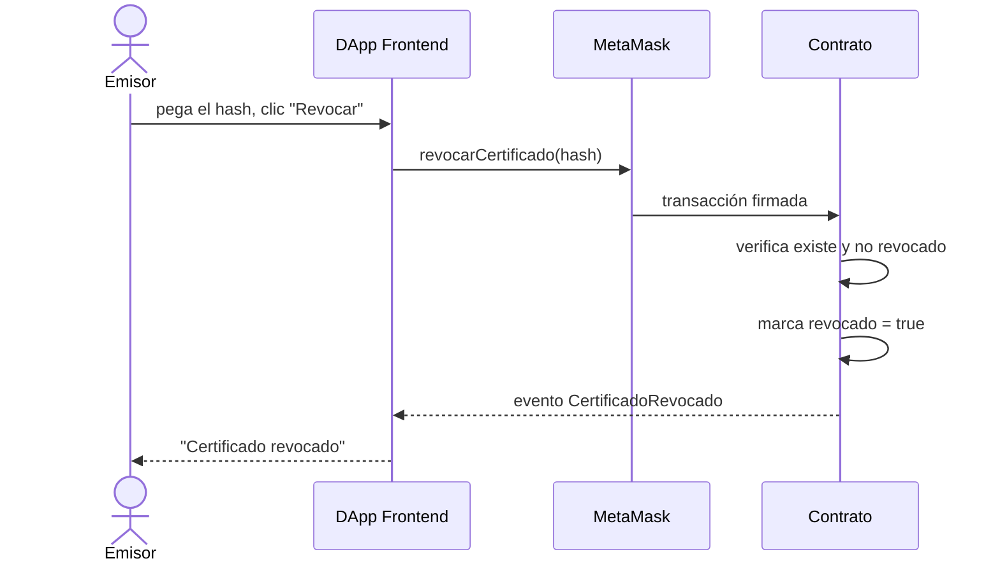

# Diagramas de secuencia

## Emitir un certificado (escritura — cuesta gas)

Si quien llama no es emisor autorizado, el contrato revierte con `NoEsEmisorAutorizado()` y
no se gasta el cambio de estado.

## Verificar un certificado (lectura — gratis)

La verificación es una llamada `view`: no crea transacción, no cuesta gas y la puede hacer
cualquiera, incluso sin billetera con fondos.

## Revocar un certificado (escritura — cuesta gas)

