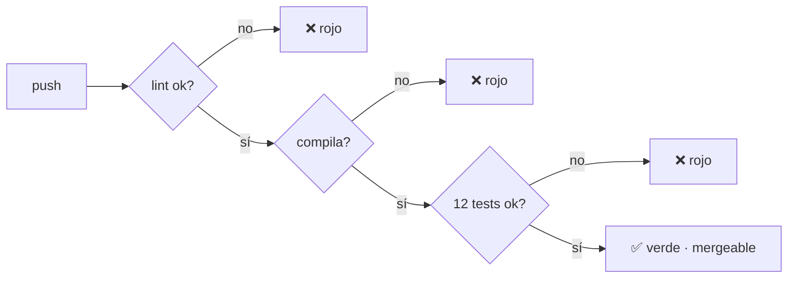

# ⚙️ Práctica DevOps — CI/CD detallado

Análisis a fondo del pipeline de Integración Continua del proyecto.
La práctica guiada está en [`guias/03-laboratorio-devops.md`](../../guias/03-laboratorio-devops.md).

---

## El workflow `ci.yml` línea por línea

Archivo: [`.github/workflows/ci.yml`](../../.github/workflows/ci.yml).

### Disparadores (`on`)

```yaml
on:
  push:
    branches: [main, develop]
  pull_request:
    branches: [main, develop]
```

El pipeline corre en cada `push` y en cada *pull request* a `main` o `develop`. Así, ningún
cambio se integra sin pasar las barreras de calidad.

### Job `build-and-test`

Corre en `ubuntu-latest`. Sus pasos:

| Paso | Comando | Para qué |
|------|---------|----------|
| Checkout | `actions/checkout@v4` | Trae el código al runner |
| Setup Node | `actions/setup-node@v4` (Node 20 + cache npm) | Entorno reproducible |
| Instalar | `npm ci` | Instalación **limpia** desde `package-lock.json` |
| Lint | `npm run lint:sol` | Calidad del contrato |
| Compilar | `npm run compile` | ¿Compila con solc 0.8.24? |
| Probar | `npm test` | Las 12 pruebas |
| Cobertura | `npm run coverage` | Métrica de calidad |
| Artefacto | `upload-artifact@v4` | Guarda el reporte de cobertura |

### ¿Por qué `npm ci` y no `npm install`?

`npm ci` instala **exactamente** las versiones de `package-lock.json`, sin modificarlo. Es
determinista y más rápido: ideal para CI. `npm install` puede actualizar el lockfile y
producir entornos distintos. **Regla:** `ci` en la nube, `install` en tu máquina la primera vez.

---

## Anatomía de una barrera de calidad



Si **cualquier** barrera falla, el pipeline queda en rojo y (si configuras protección de
rama en GitHub) el merge se bloquea. La calidad deja de depender de la disciplina humana.

---

## Buenas prácticas aplicadas

- **Pin de versiones de acciones** (`@v4`): builds reproducibles.
- **Cache de npm:** builds más rápidos.
- **Cobertura como artefacto:** se puede inspeccionar tras cada run.
- **Mismos comandos en local y CI:** lo que pasa en tu máquina pasa en la nube.

---

## De CI a CD en la nube

La **entrega/despliegue continuo** se materializa en AWS:

- **Amplify** redepliega el frontend en cada push.
- **CodePipeline + CodeBuild** recompilan, reprueban y (opcionalmente) redepliegan el
  contrato.

Detalle en [`docs/05-nube/`](../05-nube/) y práctica en
[`guias/05-despliegue-aws.md`](../../guias/05-despliegue-aws.md).
