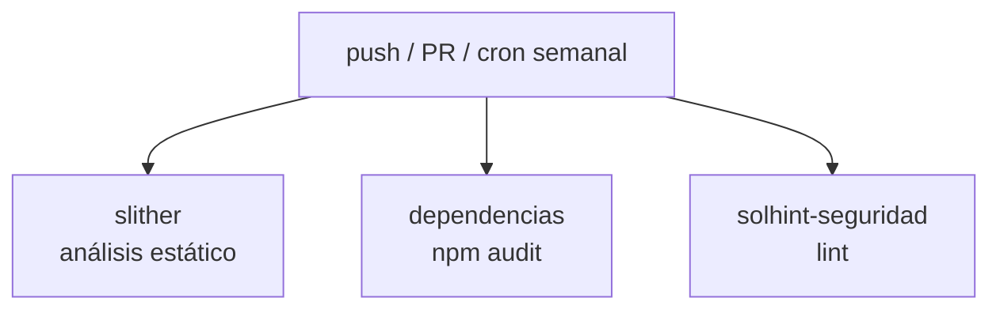
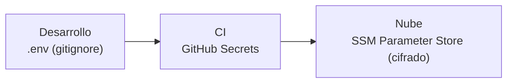

# 🔒 Práctica DevSecOps — Seguridad automatizada

Análisis del pipeline de seguridad y de los controles del contrato.
La práctica guiada está en [`guias/04-laboratorio-devsecops.md`](../../guias/04-laboratorio-devsecops.md).

---

## El workflow `devsecops.yml`

Archivo: [`.github/workflows/devsecops.yml`](../../.github/workflows/devsecops.yml).
Tres jobs en paralelo, más una ejecución programada semanal.



### Job `slither` (SAST)

Usa `crytic/slither-action` con `fail-on: high`: el pipeline **falla** si hay un hallazgo de
severidad alta. Slither detecta reentrancy, llamadas externas peligrosas, control de acceso
ausente, etc.

### Job `dependencias` (SCA)

`npm audit --audit-level=high`: revisa el árbol de dependencias contra la base de CVEs.
Falla solo en severidad alta para no bloquear por ruido de bajo nivel.

### Job `solhint-seguridad`

Linter con reglas de seguridad y estilo (`.solhint.json`). Incluye `gas-custom-errors`, que
exige errores personalizados.

### Ejecución programada (cron)

```yaml
schedule:
  - cron: "0 6 * * 1"   # lunes 06:00 UTC
```

Aunque nadie toque el código, se revisa semanalmente: un CVE nuevo en una dependencia puede
aparecer en cualquier momento.

---

## Controles de seguridad en el contrato

`contracts/RegistroCertificados.sol` aplica defensas por diseño:

| Patrón | Implementación | Riesgo que mitiga |
|--------|----------------|-------------------|
| Control de acceso por roles | `soloPropietario`, `soloEmisor` | Funciones críticas sin protección |
| Errores personalizados | `NoEsEmisorAutorizado()`, etc. | Mensajes opacos + gas innecesario |
| Validación de entradas | `DatosVacios()`, `DireccionInvalida()` | Estados corruptos |
| Eventos de auditoría | `emit` en cada cambio de estado | Falta de trazabilidad |
| Inmutabilidad | revocar en vez de borrar | Pérdida de historial |
| Aritmética segura | Solidity 0.8+ (revierte overflow) | Integer overflow |

---

## Gestión de secretos (defensa en profundidad)



- **Nunca** hay secretos en el código ni en el repositorio.
- `.gitignore` excluye `.env`, `terraform.tfvars`, `*.key`, `*.pem`.
- En AWS, los secretos se leen desde **SSM Parameter Store** en tiempo de build.
- Los roles IAM siguen el **mínimo privilegio** (ver `infra/terraform/codepipeline.tf`).

---

## Cómo leer un hallazgo de Slither

1. **Severidad:** High → atender ya; Medium → evaluar; Low/Informational → criterio.
2. **Descripción:** qué patrón detectó y por qué es riesgoso.
3. **Ubicación:** archivo y línea.
4. **Recomendación:** cómo corregirlo.

No todos los hallazgos son bugs reales (pueden ser falsos positivos), pero **todos merecen
una decisión consciente y documentada**. Esa es la mentalidad DevSecOps.
