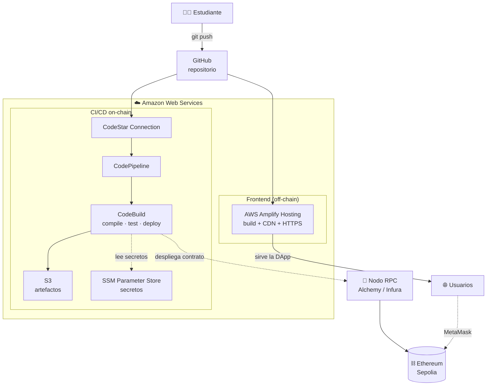
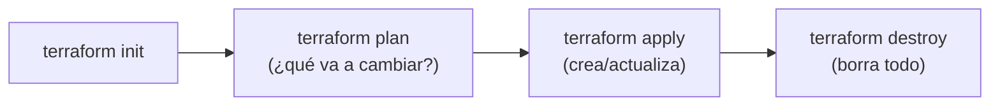

# ☁️ Arquitectura en la Nube (AWS)

Esta sección explica **cómo se lleva la DApp a producción en AWS** aplicando DevOps:
infraestructura como código (Terraform), hosting gestionado (Amplify) y un pipeline
CI/CD nativo (CodePipeline + CodeBuild).

> 🎯 La guía práctica paso a paso para montar todo esto está en
> [`guias/05-despliegue-aws.md`](../../guias/05-despliegue-aws.md). Este documento es el
> **porqué** y el **qué**; la guía es el **cómo**.

> 📘 Para entender **cómo se eligieron los servicios de AWS**, comparar el **entorno local
> vs. AWS** y los **dos pipelines** (GitHub Actions vs. AWS) con diagramas, lee
> [`seleccion-servicios-y-pipelines.md`](seleccion-servicios-y-pipelines.md).

---

## 1. Visión general

**Dos caminos desde un mismo `git push`:**

1. **Amplify** detecta el push, construye y publica el **frontend** (la DApp web) con
   CDN global y HTTPS automático.
2. **CodePipeline** detecta el push, lanza **CodeBuild**, que compila el contrato,
   ejecuta las 12 pruebas y, opcionalmente, **despliega el contrato** en la testnet
   Sepolia a través de un nodo RPC.

---

## 2. Servicios de AWS usados y por qué

| Servicio | Rol en la solución | Por qué este y no otro |
|----------|--------------------|------------------------|
| **AWS Amplify Hosting** | Hospeda y despliega el frontend estático | Cero servidores que administrar; CI/CD de frontend, CDN y HTTPS incluidos. Generoso free tier. |
| **CodePipeline** | Orquesta el flujo CI/CD on-chain | Pipeline declarativo nativo, se integra con CodeBuild y GitHub. |
| **CodeBuild** | Compila, prueba y despliega el contrato | Entornos efímeros bajo demanda; pagas por minuto de build. |
| **CodeStar Connections** | Conecta AWS con GitHub de forma segura | OAuth gestionado, sin claves embebidas. |
| **S3** | Almacena artefactos del pipeline | Barato, duradero, estándar de facto. |
| **SSM Parameter Store** | Guarda secretos (RPC URL, clave privada) | Cifrado con KMS, sin secretos en el código. Gratis en su nivel estándar. |
| **IAM** | Permisos de cada servicio | Principio de **mínimo privilegio**. |

> El **nodo RPC** (Alchemy/Infura) y la **blockchain** (Sepolia) son externos a AWS:
> la red Ethereum es descentralizada y no vive en un único proveedor de nube.

---

## 3. Infraestructura como Código (IaC) con Terraform

Toda la infraestructura está descrita en [`infra/terraform/`](../../infra/terraform/).
Nada se crea "a mano" en la consola: así la infraestructura es **reproducible**,
**versionada** y **revisable** en un pull request.

| Archivo | Qué define |
|---------|-----------|
| `versions.tf` | Versión de Terraform, proveedor AWS, etiquetas por defecto, backend de estado |
| `variables.tf` | Entradas configurables (región, repo, token, RPC...) |
| `amplify.tf` | App y rama de Amplify (hosting del frontend) |
| `codepipeline.tf` | Pipeline, CodeBuild, S3, conexión GitHub, roles IAM |
| `outputs.tf` | URL de la DApp, nombre del pipeline, ARN de la conexión... |

Flujo de trabajo de Terraform:

`plan` muestra el cambio **antes** de aplicarlo (revisión); `apply` lo ejecuta;
`destroy` elimina todo (clave para no dejar recursos costosos encendidos en un curso).

---

## 4. Modelo de costos y free tier

Esta arquitectura está pensada para caber en el **AWS Free Tier** durante el curso:

- **Amplify:** 1.000 min de build/mes y 15 GB servidos/mes gratis el primer año.
- **CodeBuild:** 100 min/mes gratis en `BUILD_GENERAL1_SMALL`.
- **S3 / SSM (estándar):** uso mínimo, prácticamente gratis.
- **CodePipeline:** 1 pipeline activo gratis al mes.

> 💡 **Buena práctica de DevOps en un curso:** ejecuta `terraform destroy` cuando
> termines la práctica para no acumular costos. Toda la infra se vuelve a crear en
> minutos con `terraform apply`.

---

## 5. Seguridad de la arquitectura (DevSecOps en la nube)

- **Secretos fuera del código:** RPC URL y clave privada viven en **SSM Parameter
  Store** (cifrado), nunca en git. El `.gitignore` excluye `.env` y `terraform.tfvars`.
- **Mínimo privilegio:** cada rol IAM (`codebuild`, `codepipeline`) solo tiene los
  permisos que necesita.
- **Conexión sin claves:** CodeStar Connections usa OAuth; no se guardan credenciales
  de GitHub en AWS.
- **Estado de Terraform:** si usas backend S3, actívalo con cifrado y acceso restringido
  (el `tfstate` puede contener valores sensibles).

---

## 6. Para profundizar

- [`guias/05-despliegue-aws.md`](../../guias/05-despliegue-aws.md) — práctica paso a paso.
- [`docs/03-devops/`](../03-devops/) — el pipeline CI/CD explicado.
- [`docs/04-devsecops/`](../04-devsecops/) — controles de seguridad.
