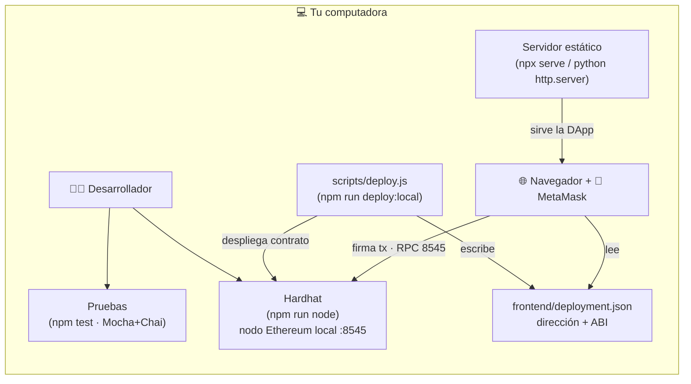
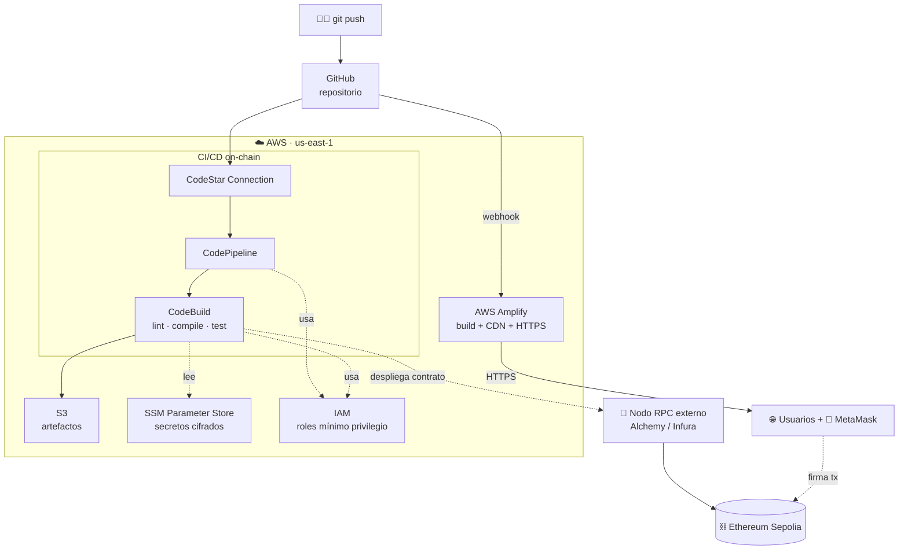
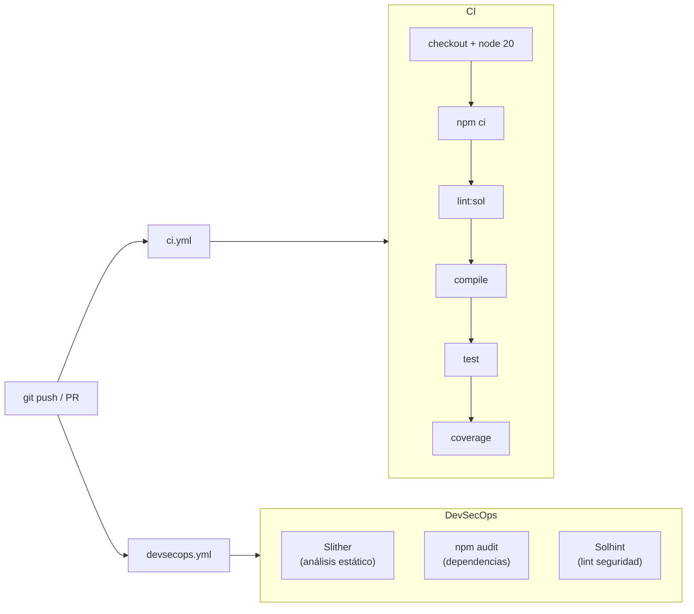
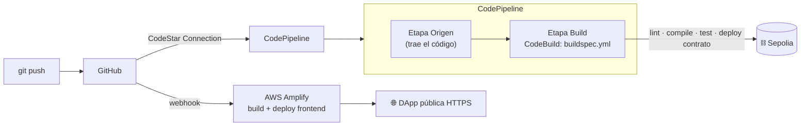

# 🧭 Selección de servicios AWS y comparación de pipelines

Este documento explica **tres cosas**, en orden:

1. **Cómo se eligen los servicios de AWS** para un proyecto como este (el método, no solo el resultado).
2. **El entorno local vs. el entorno en AWS**, con un diagrama y explicación de cada uno.
3. **Los dos pipelines** —GitHub Actions y AWS CodePipeline— diseñados, comparados y explicados.

> 🎯 Léelo después de [`docs/05-nube/README.md`](README.md) (la arquitectura general) y antes
> de la práctica [`guias/05-despliegue-aws.md`](../../guias/05-despliegue-aws.md).

---

## Parte 1 — Cómo seleccionar los servicios de AWS

No se empieza eligiendo servicios. Se empieza por las **necesidades** de la solución, y a
cada necesidad se le busca el servicio que mejor encaje según unos **criterios**.

### Paso 1: descomponer la solución en necesidades

Nuestra DApp tiene dos mundos (off-chain y on-chain) y un plano DevOps. Listamos qué hace
falta para llevarla a producción:

| # | Necesidad | ¿Por qué la tenemos? |
|---|-----------|----------------------|
| N1 | Hospedar el frontend web | La DApp es una web estática que alguien debe servir con HTTPS |
| N2 | Construir y probar el contrato automáticamente | El contrato es inmutable: hay que probarlo antes de desplegar |
| N3 | Orquestar el flujo CI/CD | Coordinar "traer código → construir → desplegar" |
| N4 | Almacenar artefactos del build | El pipeline necesita pasar archivos entre etapas |
| N5 | Guardar secretos (RPC URL, clave privada) | Nunca deben ir en el código |
| N6 | Conectar AWS con el repositorio de GitHub | El despliegue se dispara desde git |
| N7 | Gestionar permisos entre servicios | Cada componente debe poder hacer solo lo suyo |
| N8 | Acceder a la blockchain (nodo RPC) | Para desplegar el contrato y leer/escribir estado |

### Paso 2: definir los criterios de selección

Para cada necesidad, comparamos opciones con estos criterios (los típicos en decisiones de nube):

- **Costo / free tier** — ¿cabe en el nivel gratuito durante el curso?
- **Gestionado vs. autoadministrado** — ¿AWS lo opera por mí o tengo que mantener servidores?
- **Integración** — ¿se conecta de forma natural con el resto de servicios?
- **Curva de aprendizaje** — ¿es razonable para estudiantes?
- **Seguridad** — ¿permite aplicar mínimo privilegio y cifrar secretos?

### Paso 3: elegir, justificando frente a las alternativas

| Necesidad | ✅ Servicio elegido | Alternativas descartadas | Por qué este |
|-----------|--------------------|--------------------------|--------------|
| N1 Hosting frontend | **AWS Amplify Hosting** | S3 + CloudFront; EC2 + Nginx | Amplify trae CI/CD, CDN y HTTPS "de fábrica", sin servidores. S3+CloudFront es válido pero hay que cablear más piezas a mano. EC2 sería mantener un servidor: exceso para una web estática. |
| N2 Build y test del contrato | **AWS CodeBuild** | Jenkins en EC2; GitLab Runner | Contenedores efímeros bajo demanda; pagas por minuto. Jenkins exigiría administrar un servidor 24/7. |
| N3 Orquestar CI/CD | **AWS CodePipeline** | Step Functions; scripts propios | Pipeline declarativo nativo, se integra directo con CodeBuild, GitHub y aprobaciones. |
| N4 Artefactos | **Amazon S3** | EFS; volúmenes | Barato, duradero y es el estándar que CodePipeline usa por defecto. |
| N5 Secretos | **SSM Parameter Store** | Secrets Manager; variables en texto | Parameter Store (SecureString) es gratis en su nivel estándar y suficiente. Secrets Manager rota claves pero cuesta; aquí no hace falta. |
| N6 Conexión con GitHub | **CodeStar Connections** | Webhook + token embebido | OAuth gestionado por AWS, sin guardar credenciales de larga duración en la cuenta. |
| N7 Permisos | **AWS IAM (roles)** | Usar credenciales de usuario | Roles con políticas de **mínimo privilegio** por servicio; nada de claves embebidas. |
| N8 Nodo RPC | **Alchemy/Infura (externo)** | Amazon Managed Blockchain; nodo propio en EC2 | La red Ethereum es descentralizada y vive fuera de AWS. Managed Blockchain es potente pero caro y fuera del free tier; un nodo propio es complejo de operar. Para el curso, un RPC gestionado externo es lo más sensato. |

> 🔑 **La regla de oro:** prefiere servicios **gestionados** (managed) que quepan en el **free
> tier** y se **integren** entre sí, salvo que un requisito real te obligue a otra cosa. Así
> reduces lo que tienes que operar y aprender.

---

## Parte 2 — Entorno local vs. entorno en AWS

La misma DApp se ejecuta en dos contextos. Entender ambos es clave: lo que en local hace tu
máquina, en AWS lo hacen servicios gestionados.

### 2.1 Entorno LOCAL (tu computadora)

**Explicación del entorno local:**

- **Todo vive en una sola máquina.** Hardhat levanta una blockchain Ethereum *de mentira* en
  `127.0.0.1:8545` (chainId 31337) con cuentas de prueba y ETH ficticio.
- **`deploy.js`** despliega el contrato en ese nodo y genera **`deployment.json`** (dirección
  + ABI), el archivo-puente que el frontend lee para conectarse.
- **Un servidor estático** (serve o Python) publica la carpeta `frontend/` en `localhost`.
- **MetaMask** se conecta al nodo local y firma transacciones.
- **Las pruebas** (`npm test`) corren contra un nodo Hardhat en memoria.
- **Ventaja:** rápido, gratis, sin internet, ideal para desarrollar y depurar.
- **Limitación:** solo tú lo ves; todo desaparece al apagar el nodo; no hay HTTPS ni CI/CD real.

### 2.2 Entorno en AWS (producción)

**Explicación del entorno AWS:**

- **El disparador es `git push`**, no tu terminal. A partir de ahí, todo es automático.
- **Amplify** sustituye a tu "servidor estático local": construye y publica el frontend con
  **CDN global y HTTPS**, accesible para cualquiera.
- **CodePipeline + CodeBuild** sustituyen a tus comandos manuales `npm test` y `deploy.js`:
  hacen lint, compilan, prueban y (opcional) **despliegan el contrato** en Sepolia.
- El **nodo Hardhat local** se reemplaza por un **nodo RPC externo** (Alchemy/Infura) y la
  blockchain real de pruebas **Sepolia**.
- **S3, SSM e IAM** son piezas que en local ni existían: artefactos, secretos cifrados y
  permisos. Aparecen porque en producción importan la persistencia, la seguridad y el control
  de acceso.
- **Ventaja:** público, con HTTPS, reproducible y desplegado por un pipeline.
- **Costo:** pensado para free tier; recuerda `terraform destroy` al terminar.

### 2.3 Tabla de equivalencias local ↔ AWS

| Función | En local | En AWS |
|---------|----------|--------|
| Servir el frontend | `npx serve frontend` | **AWS Amplify** |
| Blockchain | Nodo Hardhat (`:8545`, chainId 31337) | **Sepolia** vía **RPC externo** |
| Desplegar el contrato | `npm run deploy:local` (a mano) | **CodeBuild** (`deploy:sepolia`) |
| Ejecutar pruebas | `npm test` (a mano) | **CodeBuild** + **GitHub Actions** |
| Guardar secretos | `.env` (local, en gitignore) | **SSM Parameter Store** (cifrado) |
| Pasar artefactos | Sistema de archivos | **Amazon S3** |
| Permisos | Tu usuario del SO | **IAM roles** |
| Disparador | Tú, en la terminal | **`git push`** + webhooks |

---

## Parte 3 — Los dos pipelines: GitHub Actions vs. AWS

Este proyecto usa **dos** sistemas de CI/CD. No es redundancia: cada uno tiene un propósito.
Aquí los diseñamos, comparamos y explicamos cuándo usar cada uno.

### 3.1 Pipeline en GitHub Actions (CI + DevSecOps)

Vive en `.github/workflows/`. Corre en los **runners de GitHub** en cada push/PR.

**Propósito:** *feedback rápido de calidad y seguridad* en cada cambio. Es la primera barrera:
si un test o un control de seguridad falla, lo sabes en minutos y el PR se marca en rojo.

### 3.2 Pipeline en AWS (CD a producción)

Definido con Terraform (`infra/terraform/`). Corre en **infraestructura de AWS**.

**Propósito:** *llevar la solución a producción en la nube* — desplegar el frontend (Amplify)
y, opcionalmente, el contrato (CodeBuild) en una red pública.

### 3.3 Comparación lado a lado

| Dimensión | GitHub Actions | AWS (CodePipeline + CodeBuild + Amplify) |
|-----------|----------------|------------------------------------------|
| **Rol en este proyecto** | CI: calidad y seguridad | CD: despliegue a producción |
| **Dónde se define** | YAML en `.github/workflows/` | Terraform (IaC) + `buildspec.yml` |
| **Dónde se ejecuta** | Runners gestionados por GitHub | Contenedores de AWS (CodeBuild) + Amplify |
| **Disparador** | push / PR / cron | push vía CodeStar Connection + webhook de Amplify |
| **Qué hace** | lint, compile, test, coverage, Slither, npm audit | lint, compile, test, **deploy del contrato y del frontend** |
| **Secretos** | GitHub Secrets | SSM Parameter Store (cifrado) |
| **Integración con AWS** | Indirecta (necesita credenciales) | Nativa (roles IAM) |
| **Costo** | Gratis para repos públicos | Free tier de AWS (con límites) |
| **Curva de aprendizaje** | Baja (un YAML) | Media (varios servicios + IaC) |
| **Acceso a recursos AWS** | Limitado | Total y nativo |

### 3.4 ¿Por qué dos pipelines? ¿No es duplicar?

Ambos compilan y prueban el contrato, sí. Pero es **intencional**, por dos motivos:

1. **Propósitos distintos.** GitHub Actions da *feedback de calidad* en cada PR (antes de
   fusionar). El pipeline de AWS *despliega* (después de fusionar). Uno protege la rama; el
   otro publica.
2. **Defensa en profundidad.** Volver a probar justo antes de desplegar, en el mismo entorno
   donde se despliega, evita el clásico "en mi máquina funcionaba". Es una red de seguridad
   adicional, barata en tiempo.

### 3.5 ¿Cuándo elegir cada uno? (más allá de este proyecto)

- **Solo GitHub Actions** si: tu app no necesita servicios de AWS, quieres simplicidad, o tu
  despliegue es a Vercel/Netlify/Pages. También puedes desplegar a AWS *desde* Actions usando
  roles OIDC, sin CodePipeline.
- **Pipeline nativo de AWS** si: ya vives en AWS, necesitas integración profunda (roles IAM,
  aprobaciones, despliegues a ECS/Lambda), o requisitos de gobernanza que pidan mantener el
  CI/CD dentro de tu cuenta.
- **Ambos (como aquí)** cuando quieres lo mejor de cada mundo: el feedback rápido y gratuito
  de Actions para calidad, y el despliegue gestionado de AWS para producción.

---

## Resumen

1. Los servicios se eligen por **necesidad → criterios → servicio**, no al revés. Prioriza
   **gestionado**, **free tier** e **integración**.
2. El **entorno local** concentra todo en tu máquina (rápido, privado, efímero); el **entorno
   AWS** reparte cada función en un **servicio gestionado** (público, seguro, reproducible).
3. **GitHub Actions** y el **pipeline de AWS** son **complementarios**: CI de calidad vs. CD de
   despliegue, y juntos forman una cadena DevOps/DevSecOps completa.
