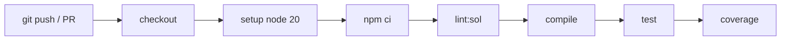

# 🎓 Guía 03 — Laboratorio DevOps (CI/CD)

> **Objetivo:** entender y ejecutar el pipeline de Integración Continua con GitHub Actions.
> **Tiempo:** 30–45 min.

---

## 1. ¿Qué es CI/CD aquí?

**Integración Continua (CI):** cada vez que subes código, una máquina automática lo
compila, lo lintea y ejecuta las pruebas. Si algo se rompe, te enteras en minutos, no en
producción.

En este repo el pipeline vive en [`.github/workflows/ci.yml`](../.github/workflows/ci.yml).



Cada paso es una **barrera de calidad**: si uno falla, el pipeline se detiene en rojo.

---

## 2. Ejecútalo

1. Sube el repo a GitHub (ver [Guía 05, Paso 1](05-despliegue-aws.md#paso-1--sube-el-proyecto-a-tu-github)).
2. Ve a la pestaña **Actions** de tu repo en GitHub.
3. Cada `push` o pull request a `main`/`develop` dispara el workflow **CI**.
4. Ábrelo y revisa cada paso en verde.

---

## 3. Experimento: rompe una prueba a propósito

Aprende viendo fallar el pipeline:

1. En `contracts/RegistroCertificados.sol`, cambia el constructor para que **no** autorice
   al propietario como emisor (comenta la línea `emisorAutorizado[msg.sender] = true;`).
2. `git commit -am "Romper a propósito" && git push`.
3. En **Actions**, el job fallará en la prueba #2. Lee el log: te dice exactamente qué
   esperaba y qué obtuvo.
4. Revierte el cambio, vuelve a hacer push: el pipeline vuelve a verde.

> 🎯 Esta es la idea central de DevOps: **retroalimentación rápida y automática**.

---

## 4. Reproduce el pipeline en local

Antes de hacer push, corre lo mismo que la CI:

```bash
npm ci          # instalación limpia y reproducible (usa package-lock.json)
npm run lint:sol
npm run compile
npm test
npm run coverage
```

Si pasa en local, pasará en la nube. Si no, arréglalo antes de subir.

---

## 5. De CI a CD (despliegue continuo)

La **entrega continua** la verás en la [Guía 05](05-despliegue-aws.md): AWS Amplify y
CodePipeline despliegan automáticamente el frontend y el contrato tras cada push. Es el
mismo concepto, llevado hasta producción en la nube.

Para profundizar en el porqué, lee [`docs/03-devops/`](../docs/03-devops/).
