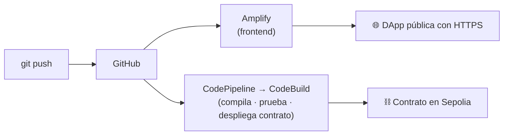

# 🎓 Guía 05 — Desplegar la DApp en AWS (paso a paso)

> **Objetivo:** llevar la DApp a la nube con **AWS Amplify** (frontend) y
> **CodePipeline + CodeBuild** (CI/CD on-chain), todo creado con **Terraform**.
> **Tiempo estimado:** 60–90 min · **Costo:** $0 si te mantienes en el free tier y
> haces `terraform destroy` al terminar.

Esta guía asume que ya ejecutaste el proyecto en local
([Guía 02](02-ejecutar-el-proyecto.md)). Vas a leer mucho "por qué", no solo "qué tecla
pulsar": eso es lo que se evalúa.

---

## 🗺️ Lo que vas a construir



---

## ✅ Requisitos previos

| Necesitas | Cómo conseguirlo |
|-----------|------------------|
| **Cuenta de AWS** | [aws.amazon.com](https://aws.amazon.com) (requiere tarjeta; usaremos free tier) |
| **AWS CLI** | [Instalar](https://docs.aws.amazon.com/cli/latest/userguide/getting-started-install.html) y luego `aws configure` |
| **Terraform ≥ 1.6** | [Instalar](https://developer.hashicorp.com/terraform/install) |
| **Cuenta de GitHub** con el repo subido | Sube este proyecto a un repo tuyo |
| **(Opcional) Cuenta Alchemy/Infura** | Para desplegar el contrato en Sepolia |

Verifica:

```bash
aws --version          # aws-cli/2.x
terraform -version     # v1.6 o superior
aws sts get-caller-identity   # debe mostrar tu cuenta (confirma que aws configure funcionó)
```

> ⚠️ **Seguridad:** crea un usuario IAM con permisos administrativos para el curso, NO uses
> la cuenta raíz. Genera sus *Access Keys* y úsalas en `aws configure`.

---

## Paso 1 — Sube el proyecto a tu GitHub

```bash
cd "ruta/al/repoSemanaDos"
git init
git add .
git commit -m "Proyecto inicial: DApp Registro de Certificados"
git branch -M main
git remote add origin https://github.com/TU_USUARIO/TU_REPO.git
git push -u origin main
```

Confirma en github.com que ves `infra/terraform/`, `buildspec.yml` y `frontend/`.

---

## Paso 2 — Crea un Personal Access Token (PAT) de GitHub

Amplify y la conexión necesitan leer tu repo.

1. GitHub → tu foto → **Settings** → **Developer settings** → **Personal access tokens**
   → **Tokens (classic)** → **Generate new token (classic)**.
2. Marca el scope **`repo`** (acceso completo a repositorios).
3. Genera y **copia el token** (`ghp_...`). Lo pegarás en `terraform.tfvars`. No lo subas a git.

---

## Paso 3 — Configura las variables de Terraform

```bash
cd infra/terraform
cp terraform.tfvars.example terraform.tfvars
```

Edita `terraform.tfvars` con tus valores:

```hcl
aws_region      = "us-east-1"
entorno         = "dev"
nombre_proyecto = "registro-certificados"

github_repo_url = "https://github.com/TU_USUARIO/TU_REPO"
github_branch   = "main"
github_token    = "ghp_xxxxxxxxxxxxxxxxxxxx"

# Opcional (solo si vas a desplegar el contrato en Sepolia desde el pipeline)
sepolia_rpc_url = "https://eth-sepolia.g.alchemy.com/v2/TU_API_KEY"
```

> `terraform.tfvars` está en `.gitignore`: contiene tu token, **nunca** se sube.

---

## Paso 4 — Crea la infraestructura con Terraform

```bash
# Descarga el proveedor de AWS
terraform init

# Muestra QUÉ se va a crear, sin crear nada todavía (revísalo)
terraform plan

# Crea la infraestructura (escribe 'yes' para confirmar)
terraform apply
```

Cuando termine, Terraform imprime los **outputs**:

```
amplify_url             = "https://main.xxxxx.amplifyapp.com"
codepipeline_nombre     = "registro-certificados-dev"
codestar_connection_arn = "arn:aws:codestar-connections:...:connection/xxxx"
```

Guarda la `amplify_url` y el `codestar_connection_arn`.

---

## Paso 5 — Autoriza la conexión con GitHub (paso MANUAL obligatorio)

La conexión de CodePipeline con GitHub nace en estado **PENDING** y **no se puede
completar por código** (requiere un handshake OAuth en el navegador):

1. Consola de AWS → busca **Developer Tools** → **Settings** → **Connections**.
2. Verás tu conexión `registro-certificados-dev-gh` en estado **Pending**.
3. Pulsa **Update pending connection** → **Install a new app** → autoriza **AWS
   Connector for GitHub** en tu repo → **Connect**.
4. El estado pasa a **Available**. ✅

> Sin este paso, la etapa "Origen" del pipeline fallará: es el error #1 de los estudiantes.

---

## Paso 6 — (Opcional) Guarda los secretos para desplegar el contrato

Si quieres que CodeBuild **despliegue el contrato en Sepolia**, guarda los secretos en
SSM Parameter Store (cifrados):

```bash
aws ssm put-parameter --name "/registro-certificados/SEPOLIA_RPC_URL" \
  --value "https://eth-sepolia.g.alchemy.com/v2/TU_API_KEY" --type SecureString

aws ssm put-parameter --name "/registro-certificados/PRIVATE_KEY" \
  --value "0xtu_clave_privada_de_PRUEBA" --type SecureString
```

Luego, en `buildspec.yml`, **descomenta** el bloque `parameter-store` y la línea
`npm run deploy:sepolia`, y haz commit/push.

> ⚠️ Usa una clave privada de una cuenta **solo de pruebas** con ETH de faucet. Nunca una
> con fondos reales. Esa es la diferencia entre DevOps y **DevSecOps**.

---

## Paso 7 — Dispara y observa el pipeline

```bash
# Haz cualquier cambio pequeño y súbelo
git commit --allow-empty -m "Probar pipeline AWS"
git push
```

Observa los dos caminos:

- **Amplify:** Consola → **Amplify** → tu app → verás el build de la rama `main` y, al
  terminar, abre la `amplify_url`: ahí está tu DApp pública con HTTPS.
- **CodePipeline:** Consola → **CodePipeline** → `registro-certificados-dev` → verás
  *Origen* → *Build* en verde. Abre el log de CodeBuild para ver `npm test` con las 12
  pruebas pasando en la nube.

---

## Paso 8 — Prueba la DApp en la nube

1. Abre la `amplify_url` en tu navegador.
2. Conecta MetaMask.
3. Si desplegaste en Sepolia, cambia MetaMask a la red **Sepolia** y emite/verifica un
   certificado real en la testnet pública.

🎉 Tu DApp está en producción, desplegada por un pipeline, sobre infraestructura creada
con código.

---

## 🧹 Paso 9 — Limpia (¡importante!)

Para no acumular costos cuando termines:

```bash
cd infra/terraform
terraform destroy   # escribe 'yes'
```

Esto borra Amplify, el pipeline, CodeBuild, el bucket S3 y los roles IAM. Los parámetros
de SSM bórralos aparte si los creaste:

```bash
aws ssm delete-parameter --name "/registro-certificados/SEPOLIA_RPC_URL"
aws ssm delete-parameter --name "/registro-certificados/PRIVATE_KEY"
```

---

## 🆘 Problemas frecuentes

| Síntoma | Causa / solución |
|---------|------------------|
| Etapa *Origen* falla | No autorizaste la conexión (Paso 5). Ponla en *Available*. |
| Amplify no construye | Token de GitHub sin scope `repo`, o caducado. Regéneralo y `terraform apply`. |
| `AccessDenied` en `apply` | Tu usuario IAM no tiene permisos suficientes. Usa un usuario admin para el curso. |
| CodeBuild falla en `npm test` | Reproduce localmente con `npm ci && npm test`. El pipeline solo refleja tu código. |
| El contrato no se despliega | Faltan los secretos en SSM (Paso 6) o no descomentaste `buildspec.yml`. |
| Miedo a costos | Todo cabe en free tier; haz `terraform destroy` al terminar. |

---

## 📊 Qué se evalúa de esta práctica

Ver [`rubrica-evaluacion.md`](rubrica-evaluacion.md). En resumen: infraestructura creada
con Terraform (no a mano), pipeline funcionando, DApp accesible por HTTPS, secretos fuera
del código, y `terraform destroy` ejecutado al final.
