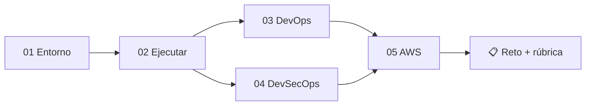

# 🎓 Guías del estudiante

Bienvenido. Estas guías te llevan de la mano, en orden, desde preparar tu computadora
hasta desplegar la DApp en la nube de AWS. Sigue los pasos en secuencia.

| # | Guía | Qué lograrás |
|---|------|--------------|
| 01 | [Preparación del entorno](01-preparacion-del-entorno.md) | Instalar Node, Git y MetaMask |
| 02 | [Ejecutar el proyecto](02-ejecutar-el-proyecto.md) | Correr la DApp completa en local |
| 03 | [Laboratorio DevOps](03-laboratorio-devops.md) | Entender y usar el pipeline CI/CD |
| 04 | [Laboratorio DevSecOps](04-laboratorio-devsecops.md) | Análisis de seguridad automatizado |
| 05 | [Desplegar en AWS](05-despliegue-aws.md) | Llevar la DApp a la nube con Terraform |

Apoyo:

- ❓ [Preguntas frecuentes](preguntas-frecuentes.md)
- 📋 [Rúbrica de evaluación](rubrica-evaluacion.md)

---

## Ruta recomendada

> 💡 Si te atascas, revisa primero las [preguntas frecuentes](preguntas-frecuentes.md).
